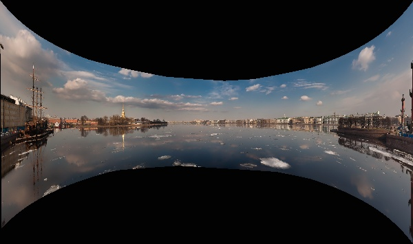

# Stitching detailed (python opencv >4.0.1)

If you want to study internals of the stitching pipeline or you want to experiment with detailed configuration you can use stitching_detailed source code available here.

`stitching_detailed` program uses command line to get stitching parameter. Many parameters exists. Above examples shows some command line parameters possible:

```
./input/boat5.jpg ./input/boat2.jpg ./input/boat3.jpg ./input/boat4.jpg ./input/boat1.jpg ./input/boat6.jpg --work_megapix 0.6 --features orb --matcher homography --estimator homography --match_conf 0.3 --conf_thresh 0.3 --ba ray --ba_refine_mask xxxxx --save_graph ./ouput/test.txt --wave_correct no --warp fisheye --blend multiband --expos_comp no --seam dp_colorgrad
```


Pairwise images are matched using an homography `--matcher homography` and estimator used for transformation estimation too `--estimator homography`.

Confidence for feature matching step is 0.3: `--match_conf 0.3`. You can decrease this value if you have some difficulties to match images.

Threshold for two images are from the same panorama confidence is 0.: `--conf_thresh 0.3`. You can decrease this value if you have some difficulties to match images.

Bundle adjustment cost function is ray `--ba ray`.

Refinement mask for bundle adjustment is `xxxxx` (`--ba_refine_mask xxxxx`) where `x` means refine respective parameter and `_` means don't. Refine one, and has the following format: fx, skew, ppx, aspect, ppy.

Save matches graph represented in DOT language to test.txt (`--save_graph ./output/test.txt`):
Labels description: 'Nm' is number of matches, 'Ni' is number of inliers, 'C' is confidence.

```
graph matches_graph{
"boat5.jpg" -- "boat2.jpg"[label="Nm=26, Ni=6, C=0.379747"];
"boat5.jpg" -- "boat3.jpg"[label="Nm=22, Ni=6, C=0.410959"];
"boat5.jpg" -- "boat4.jpg"[label="Nm=113, Ni=75, C=1.78998"];
"boat5.jpg" -- "boat1.jpg"[label="Nm=9, Ni=4, C=0.373832"];
"boat5.jpg" -- "boat6.jpg"[label="Nm=157, Ni=123, C=2.2323"];
}
```

Perform wave effect correction is no (`--wave_correct no`).

Warp surface type is fisheye (`--warp fisheye`).

Blending method is multiband (`--blend multiband`).

Exposure compensation method is not used (`--expos_comp no`).

Seam estimation estimator is Minimum graph cut-based seam (`--seam dp_colorgrad`).

You can use those arguments on command line too:

```
./input/boat5.jpg ./input/boat2.jpg ./input/boat3.jpg ./input/boat4.jpg ./input/boat1.jpg ./input/boat6.jpg --work_megapix 0.6 --features orb --matcher homography --estimator homography --match_conf 0.3 --conf_thresh 0.3 --ba ray --ba_refine_mask xxxxx --wave_correct horiz --warp compressedPlaneA2B1 --blend multiband --expos_comp channel_blocks --seam dp_colorgrad
```

You will get:



For images captured using a scanner or a drone ( affine motion) you can use those arguments on command line:

```
./input/newspaper1.jpg ./input/newspaper2.jpg --work_megapix 0.6 --features surf --matcher affine --estimator affine --match_conf 0.3 --conf_thresh 0.3 --ba affine --ba_refine_mask xxxxx --wave_correct no --warp affine
```


You can find all images in https://github.com/opencv/opencv_extra/tree/4.x/testdata/stitching